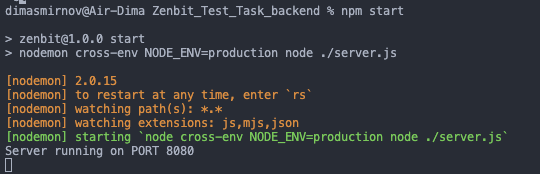

This backend is written in Node.js and uses a MySQL database. To run the database locally, simply enter the command 'npm start' in the terminal, and the server will be up and running. This database provides registration and login functionality for users, as well as the ability to log out.

